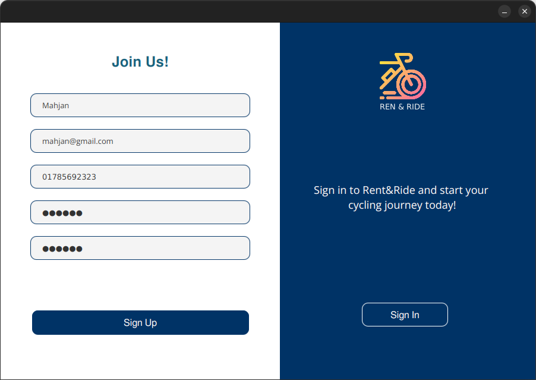
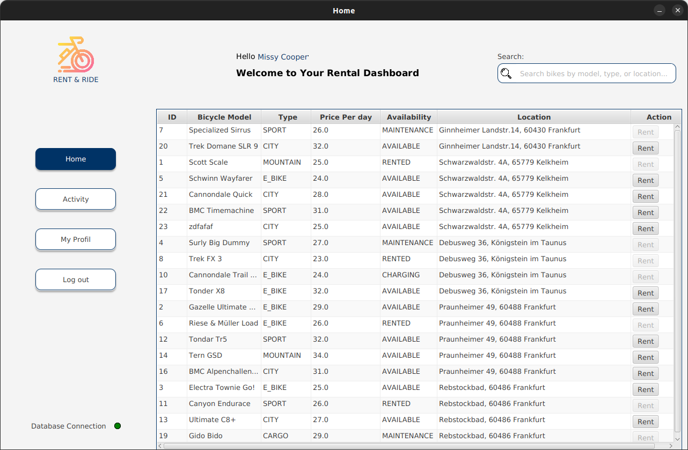
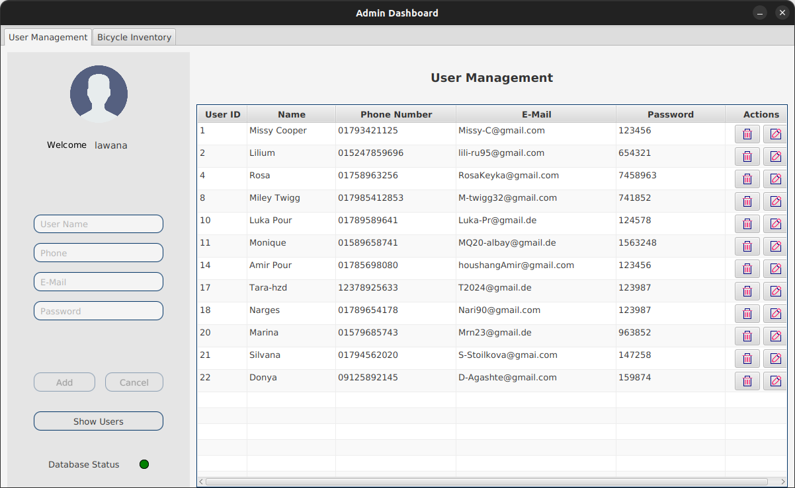

# Bike Rental Application

This repository contains the source code for a bike rental application, developed with JavaFX. The application allows users to rent bikes from various stations, manage rentals, and supports both user and admin functionalities.


## App-Screenshot

Here's a look at the application in action:







## Features

- User registration and login.
- Bike rental and return.
- Admin dashboard for managing bikes, stations, and users.
- Search and filter bikes by location, model, and availability.
- Password management for users.

## Getting Started

These instructions will help you get a copy of the project up and running on your local machine for development and testing purposes.

### Prerequisites

- Java JDK 21 or newer. Ensure you are using an LTS version for the best stability and support. For instance, version 21.0.2 as of October 17, 2023, is a good choice.
- This project uses [Maven](https://maven.apache.org/)as its build management tool.
- An Integrated Development Environment (IDE) that supports Java and JavaFX, such as IntelliJ IDEA or Eclipse.
- A MySQL or MariaDB database for storing and managing application data.


### Installation

1. Clone the repository to your local machine:

```bash
git clone git@github.com:mahboube89/BikeRental-Java.git
```
2. Open the project in your IDE.
3. Configure the database connection by adjusting the relevant values in src/main/java/org/mr/abschlussprojekt/bikeRental/database/DatabaseManager.java on line 53:
```java
connection = DriverManager.getConnection("jdbc:mysql://localhost:3306/bike_rental", "yourUsername", "yourPassword");

```
Replace "yourUsername" and "yourPassword" with your actual database credentials.

4. Start the application in your IDE. Usually, this can be done by running the main method of the application's main class.


### Importing the Database

A database export file (BikeRentalDB.sql) is located in the project folder. Follow these steps to import the database:

#### Via Command Line:

1. Open the command line or terminal.
2. Change to the directory containing the BikeRentalDB.sql file.
3. Execute the following command to create the bike_rental database and import the data (replace yourUsername and yourPassword with your MySQL credentials):
```bash
mysql -u yourUsername -pyourPassword -e "CREATE DATABASE IF NOT EXISTS bike_rental; USE bike_rental; SOURCE BikeRentalDB.sql;"

```
#### Via phpMyAdmin:
1. Log in to phpMyAdmin and select the bike_rental database.
2. Click on the "Import" tab.
3. Click "Browse" and select the BikeRentalDB.sql file from your file system.
4. Click "OK" or "Start" to begin the import process.

Note: Ensure you have created the necessary tables in your MySQL database before running the application.


## Demo Access

To explore the app's features without signing up, feel free to use the following demo credentials:

### User Access
- **Username:** user
- **Password:** 654321

### Admin Access
- **Username:** admin
- **Password:** 123456


## Acknowledgements

Although this project was an individual effort, I would like to give special thanks to:

- **[JavaFX - Java-Programme mit Oberflächen (GUIs) erstellen](https://www.udemy.com/course/javafx-java-programme-mit-oberflaechen-guis-erstellen/)** by Christian Gesty on Udemy. This course taught me both fundamental and advanced concepts of JavaFX that were essential for the development of this application.


### Lizenz
This project is licensed under the [MIT-Lizenz](LICENSE.md).
